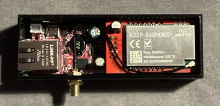

-   **Radio:** SX1262 Ebyte E22P-868M30S radio chip.
-   **LoRa Power:** 1W, TCXO

## Pins (SX1262)
all pins used by the **UEXT** connector

| Function         | GPIO Pin | 
| :--------------- | :------- | 
| SPI Clock        | 14       |
| SPI MISO         | 15       | 
| SPI MOSI         | 2       | 
| Chip Select (CS) | 5        |
| Radio Reset      | 4       | 
| Interrupt / DIO1 | 13       |
| Busy Signal      | 36       | 
| Receive Enable   | -1       |
| Transmit Enable  | 16       | 

https://github.com/OLIMEX/ESP32-POE/blob/master/DOCUMENTS/ESP32-POE-PINOUT.png

